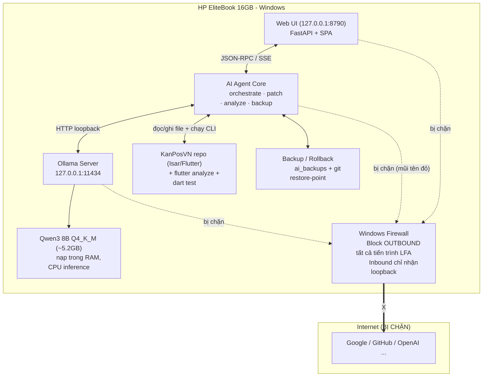
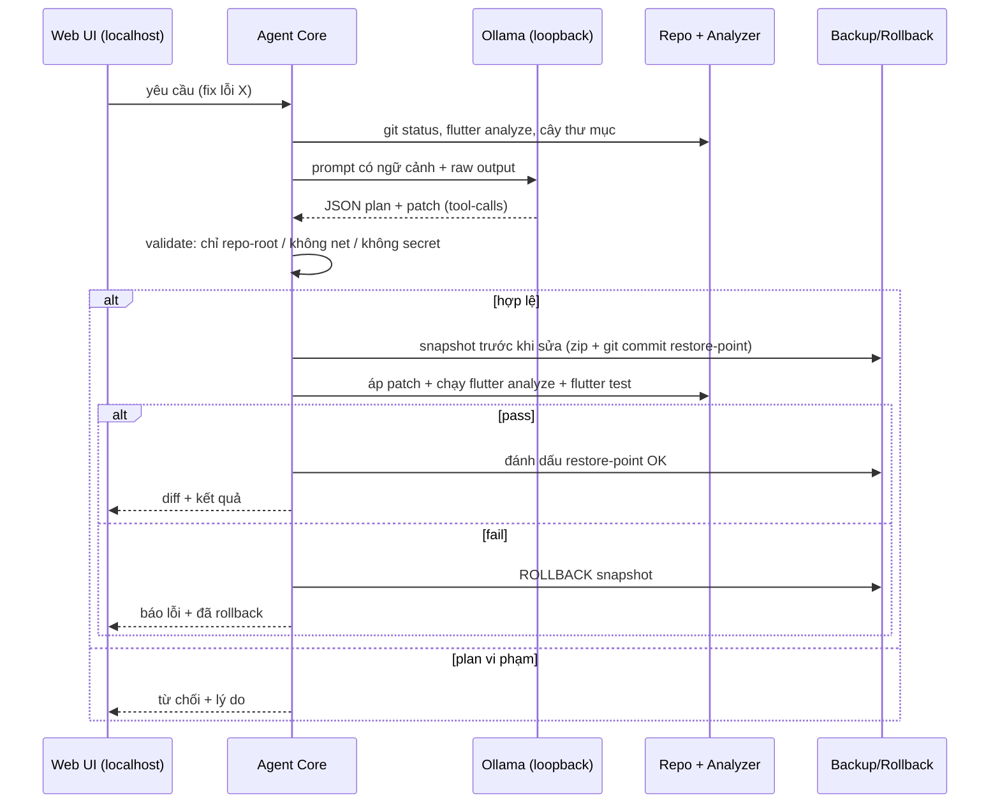
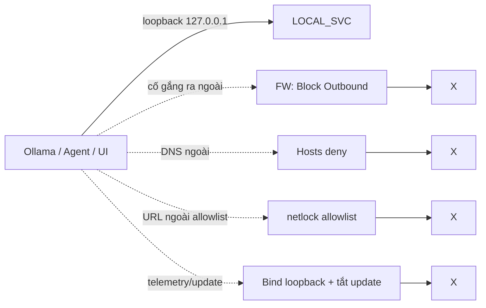

# Đặc tả Kiến trúc — Local Flutter AI Assistant (LFA) cho HP EliteBook 16GB

Tài liệu thiết kế một **Trợ lý AI cho lập trình Flutter/Dart 100% Local** (không Internet),
dựa trên mô hình Hybrid Cloud & Local trong `LOCAL_SERVER_ARCHITECTURE.md`,
chạy trên màn hình Windows (HP EliteBook 16GB RAM).

Trọng tâm an toàn: **mọi luồng AI bị khóa mạng tuyệt đối — source code không bao giờ rời máy.**

---

## 1. Mục tiêu

- Trợ lý AI mã nguồn mở chạy hoàn toàn trên máy: **Ollama + Qwen3 8B (Q4_K_M ≈ 5.2 GB)**.
- Chạy tốt trên Windows 8–16 GB RAM (HP EliteBook 16 GB là mục tiêu chính).
- Hỗ trợ đọc hiểu code, **phân tích Flutter/Dart**, tự sửa code, chạy test.
- **Backup trước khi sửa + Rollback tự động** khi lỗi.
- Giao diện web trên **localhost** (127.0.0.1).
- **Khóa toàn bộ network của AI**: không kết nối ra ngoài, không gửi dữ liệu, không telemetry.

Nguyên tắc "Air-gapped Development":
> Model AI, Agent và Web UI chỉ được phép nói chuyện với nhau qua loopback.
> Không một tiến trình nào trong bộ LFA có quyền mở kết nối OUTBOUND ra Internet.

---

## 2. Kiến trúc Tổng thể



### 2.1 Luồng thao tác chính

1. Nhà phát triển nhập yêu cầu trong **Web UI** (localhost).
2. **Agent Core** thu thập ngữ cảnh: cây thư mục, `git diff`, kết quả `flutter analyze`, file liên quan.
3. Agent gửi prompt + ngữ cảnh tới **Ollama loopback** (127.0.0.1:11434).
4. Qwen3 trả về kế hoạch + patch (định dạng JSON tool-call).
5. Agent **xác thực plan** (chỉ sửa trong repo, không net, không secret) → **tạo backup** → áp patch.
6. Chạy `flutter analyze` / `dart analyze` / `flutter test`.
7. Thành công → đánh dấu restore-point. Thất bại → **tự rollback** về snapshot.
8. Trả kết quả + diff về Web UI.

---

## 3. Thành phần & Công nghệ

| Thành phần | Công nghệ | Cổng / Ghi chú |
|---|---|---|
| Model serving | **Ollama** (Windows native) | `127.0.0.1:11434` |
| Model | **Qwen3 8B** (`qwen3:8b-q4_K_M`, ≈5.2 GB) | nạp RAM, chạy CPU |
| Agent Core | **Python 3.11+** (FastAPI + tiến trình worker) | tách logic UI / agent |
| Web UI | SPA tĩnh (React-lite hoặc vanilla) phục vụ bởi FastAPI | `127.0.0.1:8790` |
| Analyzer | `flutter analyze`, `dart analyze`, `flutter test` | chạy local CLI |
| Backup | Zip snapshot + Git restore-point | `lfa/backups/` |
| Khóa mạng | Windows Firewall + allowlist loopback + cấu hình Ollama | kernel-level |

Lựa chọn HĐH: **Windows native** (không cần Docker/WSL) — Ollama Windows đã bind loopback mặc định, dễ giám sát bằng Firewall.

---

## 4. Hạ tầng phần cứng & Sizing

### 4.1 HP EliteBook 16 GB (mục tiêu chính)

| Loại | Giá trị | Ghi chú |
|---|---|---|
| CPU | i5/i7 thế hệ 10+ (8–12 luồng) | dùng 6–8 luồng cho model |
| RAM | 16 GB | thoải mái; phải đóng bớt Browser/IDE nặng khi chạy |
| Model RAM khi chạy | ≈ 5.5–6.5 GB | Q4_K_M + KV-cache 8k ctx |
| Ổ cứng | ~7 GB trống | model 5.2 GB + runner + backups |
| Lượng RAM hệ điều hành + IDE còn lại | ≥ 8 GB | Windows 11 + VS Code + Flutter |

### 4.2 Máy 8 GB (tối thiểu, chạy được nhưng chậm)

- Đóng mọi app nặng; dùng `qwen3:4b` hoặc `granite3.2:8b-instruct-q4_K_M` nếu muốn tuột.
- Đặt `OLLAMA_CONTEXT_LENGTH=4096`, `OLLAMA_NUM_PARALLEL=1`.

### 4.3 Biến môi trường Ollama khuyến nghị

```env
OLLAMA_HOST=127.0.0.1:11434
OLLAMA_KEEP_ALIVE=30m            # giữ model nạp sẵn 30 phút
OLLAMA_CONTEXT_LENGTH=8192       # đủ cho đọc file code
OLLAMA_NUM_PARALLEL=1            # 1 request/lúc -> tiết kiệm RAM
OLLAMA_MAX_LOADED_MODELS=1
OLLAMA_NOPRUNE=0
```
> Model chỉ tải về **1 lần duy nhất lúc cài đặt** (cần Internet). Sau khi khóa mạng, Ollama chạy offline hoàn toàn.

---

## 5. Cài đặt (Install)

### 5.1 Bước chuẩn bị — tải model TRƯỚC khi khóa mạng

```powershell
# 1) Cài Ollama (window, exe ~700MB)
winget install --id Ollama.Ollama

# 2) Tải Qwen3 8B Q4 thô (~5.2GB) - CẦN Internet LẦN NÀY
ollama pull qwen3:8b-q4_K_M

# 3) Tạo model tùy biến riêng cho LFA (system prompt ràng buộc)
ollama create lfa-qwen3 -f config\Modelfile

# 4) Dừng Ollama + set biến môi trường + bật LOCKDOWN (mục 10)
```

### 5.2 Thiết lập Python Agent

```powershell
py -3.11 -m venv .venv
.\.venv\Scripts\pip install --no-cache-dir fastapi uvicorn jinja2 requests
```

### 5.3 Cấu trúc thư mục

```
D:\GIAI_TRI_SHARED_HP\...\kanposvn\tools\lfa\
├── agent\
│   ├── main.py              # FastAPI + SSE thời gian thực
│   ├── core.py              # vòng lặp Agent
│   ├── tools\
│   │   ├── ctx.py           # ngữ cảnh: tree, git diff, file reader
│   │   ├── analyzer.py      # gọi flutter/dart analyze + test
│   │   ├── patcher.py       # parse patch JSON -> áp dụng an toàn
│   │   ├── backups.py       # zip snapshot + manifest
│   │   └── netlock.py       # allowlist URL: CHỈ loopback
│   └── prompts\
│       └── system.md        # AIRGAPPED system prompt
├── ui\
│   └── static\              # SPA: index.html, app.js, styles.css
├── config\
│   ├── Modelfile            # tùy biến model
│   └── agent.yaml           # repo root path, back-up retention,...
├── backups\                 # snapshot zip + manifest.json (gitignore)
└── scripts\
    ├── install.ps1
    ├── start.ps1
    ├── lockdown.ps1
    ├── check_security.ps1
    └── rollback.ps1
```

---

## 6. Agent Core — Vòng lặp "planner-executor"-auto-rollback

### 6.1 Sơ đồ vòng lặp



### 6.2 Schema tool-call (Qwen3 trả về JSON)

```json
{
  "plan": [
    { "tool": "read_file", "args": { "path": "lib/main.dart" } },
    { "tool": "run_analyzer", "args": { "scope": "lib test" } },
    { "tool": "apply_patch", "args": {
        "file": "lib/main.dart",
        "patch": "@@ ... @@" } },
    { "tool": "run_test", "args": { "test": "test/modules" } }
  ],
  "summary": "Sửa lỗi overflow ...",
  "risk": "low"
}
```

Danh sách tool mà Agent thực thi (mỗi tool đều qua lớp `netlock.py`):
- `read_file`, `list_dir`, `read_git_diff`, `read_analyze_output`
- `apply_patch` (chỉ đích trong repo root)
- `run_analyzer`, `run_test`, `make_backup`, `perform_rollback`

### 6.3 Ràng buộc mã nguồn (Agent code-level)

- Mọi HTTP request đi qua hàm `safe_get(url)` của `netlock.py`: **allowlist chỉ `http://127.0.0.1:11434` và `http://127.0.0.1:8790`**; URL khác → raise + log + phản hồi UI.
- Agent không install thư viện thêm sau runtime; không chạy `pip/ollama pull` sau khi lockdown.
- Không đọc file: `.env`, `*.secret`, key lưu trong `secrets/` (blacklist path).

### 6.4 System Prompt (trích — `config/Modelfile`)

> Bạn là AI LẬP TRÌNH AIR-GAPPED. Chỉ hoạt động trên máy local này.
> CẤM gợi ý, tạo, hoặc gọi bất kỳ lệnh nào: tải gói từ mạng, gửi dữ liệu ra ngoài,
> truy cập URL ngoài `localhost`. Mọi trả lời chỉ chứa plan JSON + giải thích.
> Không hiển thị secret, không ghi key. File hợp lệ CHỈ trong repo hiện tại.

```dockerfile
# config/Modelfile
FROM qwen3:8b-q4_K_M
SYSTEM """
Bạn là AI lập trình Flutter/Dart chạy offline trên Windows.
Chỉ được gọi các tool cục bộ trong JSON plan.
CẤM gọi mạng ngoài localhost, CẤM gợi ý cài gói cần Internet.
Trả lời ngắn, đúng cú pháp Dart, theo chuẩn analysis của project.
"""
PARAMETER temperature 0.3
PARAMETER num_ctx 8192
PARAMETER stop "<|im_end|>"
```

---

## 7. Analyzer + Tự sửa code (Flutter/Dart)

Luồng "tự sửa" được ghép chặt với analyzer:

1. Agent chạy lệnh: `flutter analyze` hoặc `dart analyze lib test` → **bắt quả** các lỗi.
2. Cho kết quả analyze vào prompt cùng file liên quan.
3. Model đề xuất patch tối thiểu, đóng gói theo chuyển phép chuyển.
4. Agent áp patch → chạy lại đúng scope analyzer.
5. Chỉ coi là xong khi: analyze hết lỗi **VÀ** `flutter test` không phá vỡ test mới (cho phép đúng danh sách test pre-known fail).

> Lệnh mặc định (đồng bộ với repo KanPosVN):
> - `flutter analyze --no-fatal-infos`
> - `dart analyze lib test`
> - `flutter test`  (với danh sách các test đã biết fail trước — không cố sửa nếu nằm ngoài phạm vi)

---

## 8. Backup & Rollback

### 8.1 Hai tầng snapshot

1. **Git restore-point** (mượn cơ chế git có sẵn của repo):
   ```powershell
   git add -A
   git commit -m "ai-restore YYYYMMDD_HHMMSS - <summary>"
   ```
   → rollback nhanh: `git reset --hard <sha>`.
2. **Zip snapshot** (bê nguyên tinh thần `kanposvn_backup`) — an toàn khi repo bị hỏng nặng:
   ```powershell
   tar -a -cf "backups\ai_YYYYMMDD_HHMMSS.zip" ` --exclude=".git" --exclude=".dart_tool" `
     --exclude="build" --exclude="node_modules" --exclude="backups" .
   ```

### 8.2 Manifest & Retention

```json
{
  "points": [
    { "id": "ai_20260701_103000",
      "at": "2026-07-01T10:30:00Z",
      "request": "Fix lỗi overflow dashboard",
      "git_sha": "abc123",
      "zip": "ai_20260701_103000.zip",
      "status": "keep" }
  ]
}
```
- Trước mỗi lần áp patch: tạo point mới. Sau khi verify pass: giữ; fail: rollback + đánh dấu.
- Retention mặc định: **giữ 30 point gần nhất**, tự xóa cũ.

### 8.3 Rollback

```powershell
# rollback.ps1 -Id ai_20260701_103000
# 1) git reset --hard <git_sha>
# 2) giải nén zip đè lên thư mục repo
# 3) xóa snapshot fail khỏi manifest
```

---

## 9. Giao diện Localhost (Web UI @ http://127.0.0.1:8790)

Chạy người dùng **không cần đăng nhập Internet**; FastAPI gắn `host="127.0.0.1"`.

```
┌────────────────────────────────────────────────────────┐
│  [Assistant]  [Code Review]  [Analyzer]  [Backup]  [Bảo mật] │
├────────────────────────────────────────────────────────┤
│  Chat:  ...                                     [Gửi]  │
│  ┌──────────────────────────────────────────────────┐  │
│  │  Plan JSON + Patch preview (diff)               │  │
│  │  ✅ flutter analyze: 0 issues                    │  │
│  │  ✖ flutter test: 3 fail → [ROLLBACK đã làm]      │  │
│  └──────────────────────────────────────────────────┘  │
│  Trạng thái: Ollama ●Khỏe  Model ●lfa-qwen3  Mạng ●OFF │
└────────────────────────────────────────────────────────┘
```

- **Assistant**: chat + switch tự sửa (auto-fix on/off).
- **Code Review**: chọn file → agent phân tích → đề xuất.
- **Analyzer**: nút chạy `flutter analyze` / `dart analyze` / `flutter test`; hiện output.
- **Backup**: danh sách restore-point, nút "Backup now", "Rollback -> point".
- **Bảo mật**: panel gọi `check_security.ps1` — hiện bảng PASS/FAIL online.

> UI chỉ phục vụ qua loopback. Không đăng ký service bên ngoài; không nhúng font/CDN — tất cả asset đặt local tránh gọi mạng.

---

## 10. KHÓA MẠNG TOÀN PHẦN (trọng tâm) 🔒

> Triết lý **defense-in-depth**: chặn ở 4 tầng. Bẻ 1 lớp vẫn còn 3 lớp chặn.

### 10.1 Tầng 1 — Windows Firewall: chặn OUTBOUND theo tiến trình

```powershell
# lockdown.ps1 (chạy với quyền Admin)
$progs = @(
  "$env:LOCALAPPDATA\Programs\Ollama\ollama.exe"
  "$env:LOCALAPPDATA\Programs\Ollama\ollama app.exe"
  "$PWD\.venv\Scripts\python.exe"
)

foreach ($p in $progs) {
  New-NetFirewallRule -DisplayName "LFA-Block-Out-$([IO.Path]::GetFileName($p))" `
    -Direction Outbound -Program $p -Action Block -Profile Any
  New-NetFirewallRule -DisplayName "LFA-Block-In-$([IO.Path]::GetFileName($p))" `
    -Direction Inbound  -Program $p -Action Block -Profile Any
}
# Tầng phòng hộ thêm: chặn outbound Node (nếu Agent viết bằng Node) + Terminal UI
```

> Lưu ý: luật Outbound **chặn mọi đích**, nhưng không ảnh hưởng loopback
> (firewall Windows cho phép loopback nội bộ). Vì vậy Ollama↔Agent↔UI vẫn chạy.

### 10.2 Tầng 2 — Bind loopback + tắt telemetry/update

```powershell
# Biến môi trường hệ thống
[Environment]::SetEnvironmentVariable("OLLAMA_HOST","127.0.0.1:11434","User")
[Environment]::SetEnvironmentVariable("OLLAMA_DEBUG","0","User")
Remove-Item Env:HTTP_PROXY, Env:HTTPS_PROXY, Env:ALL_PROXY -ErrorAction SilentlyContinue
# Agent/UI trong code: host="127.0.0.1" cố định, không đọc PROXY từ env
```

### 10.3 Tầng 3 — Allowlist loopback trong Agent (`netlock.py`)

```python
ALLOWED = {"http://127.0.0.1:11434", "http://localhost:11434",
           "http://127.0.0.1:8790"}
def safe_request(url, **kw):
    if url.split("/")[0:3] and "/".join(url.split("/")[:3]) not in ALLOWED:
        raise NetworkBlocked(f"{url} bị chặn (ngoài allowlist)")
    ...  # connect qua loopback socket, không DNS public
```

### 10.4 Tầng 4 — HOSTS + Giám sát (phòng hộ)

- (Tùy chọn) thêm dòng chặn vào `C:\Windows\System32\drivers\etc\hosts`:
  ```
  127.0.0.1 api.openai.com
  127.0.0.1 huggingface.co
  127.0.0.1 ollama.com
  ```
- `check_security.ps1` định kỳ (hoặc bấm nút "Bảo mật" trên UI) xác nhận:
  - Firewall rules tồn tại + đang `Enabled`.
  - Ollama đang nghe đúng `127.0.0.1:11434` (netstat), không nghe `0.0.0.0`.
  - Không có kết nối **ESTABLISHED outbound** nào từ các exe bị bảo vệ tới IP ngoài.
  - Env proxy trống, allowlist `netlock.py` nguyên vẹn (checksum).

### 10.5 Xác minh trạng thái

```powershell
# chạy trong start.ps1 sau lock
vercel / ollama ps                          # model đang nạp
Get-NetFirewallRule -DisplayName "LFA-*"    # Active/Enabled
Test-NetConnection 127.0.0.1 -Port 11434    # loopback OK
Test-NetConnection 8.8.8.8 -Port 80         # phải FAIL nếu đang air-gap
```

### 10.6 Sơ đồ tầng bảo vệ



---

## 11. Scripts (nội dung tham chiếu để cài đặt)

### 11.1 `scripts/install.ps1`
```powershell
# - Tải/cài Ollama
# - ollama pull qwen3:8b-q4_K_M  (CẦN NET 1 LẦN)
# - ollama create lfa-qwen3 -f ..\config\Modelfile
# - tạo venv, pip install fastapi uvicorn jinja2 requests
# - nhắc: chạy lockdown.ps1 NGAY SAU khi pull xong
```

### 11.2 `scripts/start.ps1`
```powershell
# 1) set OLLAMA_HOST=127.0.0.1:11434 (nếu chưa set)
# 2) Start-Process ollama serve (nếu chưa chạy)
# 3) python agent\main.py --host 127.0.0.1 --port 8790
# 4) mở http://127.0.0.1:8790
# 5) gọi check_security.ps1 -Quick
```

### 11.3 `scripts/check_security.ps1` (kết quả JSON → UI "Bảo mật")

```powershell
$pass = @()
$fail = @()
# 1) Firewall rules
foreach ($r in Get-NetFirewallRule -DisplayName "LFA-*") {
  if ($r.Enabled -and $r.Direction -eq 'Outbound' -and $r.Action -eq 'Block') { $pass += $r.DisplayName }
  else { $fail += $r.DisplayName }
}
# 2) Ollama bind check
$ls = Get-NetTCPConnection -LocalPort 11434 -State Listen -ErrorAction SilentlyContinue
if ($ls | Where-Object LocalAddress -ne '127.0.0.1') { $fail += 'ollama listen non-loopback' }
# 3) Outbound ESTABLISHED từ exe LFA
$guarded = Get-NetTCPConnection -State Established |
  Where-Object { $_.OwningProcess } | ForEach-Object {
    $proc = Get-Process -Id $_.OwningProcess -ErrorAction SilentlyContinue
    if ($proc -and $proc.Path -match 'ollama|\.venv') { $_ }
  }
if ($guarded | Where-Object { $_.RemoteAddress -notmatch '^(127\.0\.0\.1|\[::1\]|::1)' }) { $fail += 'outbound from LFA process' }
# 4) proxy env
if ($env:HTTP_PROXY -or $env:HTTPS_PROXY) { $fail += 'proxy env set' }

[pscustomobject]@{ checks=$pass; fails=$fail } | ConvertTo-Json
```

---

## 12. Quy trình sử dụng điển hình

1. Bật Wi-Fi/Ethernet **hoặc không** đều được (offline-first).
2. Chạy `scripts\start.ps1`.
3. Mở `http://127.0.0.1:8790` → tab Bảo mật xác nhận toàn **PASS**.
4. Gõ: *"flutter analyze đang báo lỗi ở lib/modules/kanposvnphongkham, hãy sửa và chạy test"*.
5. Agent: phân tích → backup → patch → analyze/test → báo diff.
6. Muốn lùi: tab Backup → Rollback.

---

## 13. Kiểm thử & Nghiệm thu (Acceptance checklist)

| # | Kiểm tra | Kết quả mong đợi |
|---|---|---|
| 1 | `check_security.ps1` | `fails = []` |
| 2 | Ngắt Wi-Fi/Ethernet hoàn toàn, vẫn chat được với Qwen3 | ✅ |
| 3 | Yêu cầu agent "fetch https://..." | bị chặn + thông báo NetworkBlocked |
| 4 | `netstat -ano` — không có ESTABLISHED tới IP ngoài từ exe LFA | ✅ |
| 5 | Backup tạo zip trước khi patch; rollback khôi phục đúng | ✅ |
| 6 | `flutter analyze` gọi được và trả output cho model | ✅ |
| 7 | Auto-fix hết lỗi analyze đơn giản trong repo test thử | ✅ |

---

## 14. Hiệu năng & Tinh chỉnh

- **RAM 16GB**: đóng Chrome/Edge còn 2–3 tab; VS Code nhẹ; token 8k.
- **CPU**: để Ollama dùng 6–8 luồng (mặc định tối ưu trên máy xách tay).
- Mong đợi tốc độ: Qwen3 8B Q4 trên CPU EliteBook ≈ 4–8 token/s — đủ cho sửa file vừa; tránh đưa cả `build/`, `.dart_tool/` vào context.
- Nếu muốn nhanh hơn: `qwen3:4b` hoặc bật thêm pagefile tối thiểu 16GB cho Ollama.

---

## 15. Lộ trình triển khai (phases)

1. **P1 — Nền tảng**: cài Ollama + Qwen3, lockdown.ps1 + check_security.ps1, chạy chat đơn giản (curl loopback).
2. **P2 — Agent thô**: `ctx.py` + `analyzer.py` + `patcher.py`, loop plan JSON, minh chứng sửa 1 file + rollback.
3. **P3 — Giao diện**: FastAPI + SPA đủ 5 tab, SSE log real-time.
4. **P4 — Hoàn thiện**: retention, manifest, prompt improve, bộ test crazy, tài liệu vận hành.

---

## 16. Ghi chú mở rộng

- Mô hình này có thể nhân bản cho từng module KanPosVN (phongkham, ordertq, nhathuoc, ...) cùng lúc nhờ đọc `lib/modules/*` và `test/modules/*`.
- Tương thích với quy ước backup hiện tại của repo: snapshot zip dùng cùng danh sách exclude như `kanposvn_backup_*`.
- **Giới hạn mô hình**: Qwen3 8B là model thông dụng, không mạnh bằng cloud; chấp nhận nhiều "hỏi lại" cho các bug phức tạp. Đổi model (ví dụ `qwen3:14b`, `swordsman90/Qwen3-8B-ToolUse` hoặc `glm4`) chỉ cần đổi `FROM` trong Modelfile mà không đổi agent.